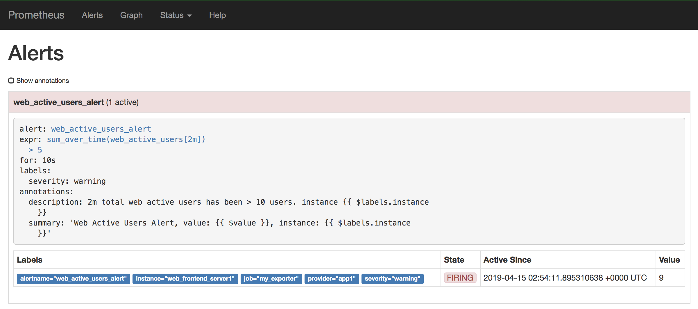

# Prometheus-Grafana-in-one-container
3 components in one-stop, and `very useful for local monitoring development`:
- Grafana
- Prometheus
- Prometheus-pushgateway
- Prometheus-alertmanager

# Installation
1. make sure you have [docker-compose](https://docs.docker.com/compose/) installed
2. execute commands next:
    ```bash
    git clone https://github.com/morganwu277/docker-app-grafana-prometheus
    # create and start container
    docker-compose up -d 
    # stop containers
    docker-compose stop
    # start the created containers again
    docker-compose start 
    ```
3. open `http://127.0.0.1:3000/` for local grafana, it's up and a default `prometheus-2-0-overview` dashboard is installed there.


# How to play?

1. Send metrics using pushgateway

    After `docker-compose up -d`, you should be able to see an `docker-app-grafana-prometheus_prometheus-client-example_1` container running there doing next tasks:

    Here is the script we can use to send metrics: 
    ```bash
    # prometheus gateway server info
    HOST="127.0.0.1"
    PORT="9091"
    PROTOCOL="http"
    
    function push_prometheus {
      metric_name="$1"
      value="$2"
      instance="$3"
      cat <<EOF | curl --data-binary @- ${PROTOCOL}://${HOST}:${PORT}/metrics/job/my_exporter/instance/$instance 
      # HELP $metric_name Metric autogenerated by my customized application
      # TYPE $metric_name gauge
      $metric_name{provider="app1"} $value
    EOF
    }
    # how to use it? 
    #push_prometheus "$prometheus_metric_name" "$value" "$instance"
    ```
    
    Here I send the random values every 5 seconds
    ```bash
    while true; do
      push_prometheus "web_active_users" "$(($RANDOM%10))" "web_frontend_server1"
      push_prometheus "web_active_users" "$(($RANDOM%10))" "web_frontend_server2"
      push_prometheus "web_active_users" "$(($RANDOM%10))" "web_frontend_server3"
      sleep 15
    done
    
    ```

2. Review the metric, you have 2 options:

    1. `Prometheus Web UI`: open http://127.0.0.1:9090/graph and type `web_active_users`
    2. `Grafana`: open http://127.0.0.1:3000/explore and type `web_active_users`

    For PromQL, please check out https://prometheus.io/docs/prometheus/latest/querying/basics/ 

3. Creating alert alert rules in `./conf/prometheus/alerts`, 
    
    For alerting rules, please checkout https://prometheus.io/docs/prometheus/latest/configuration/alerting_rules/

    You can checkout alerts firing using this link: http://127.0.0.1:9090/alerts , here is an example
    
    

4. Reload Prometheus config after creating alert rules: 
```bash
docker exec docker-app-grafana-prometheus_prometheus-server_1 kill -HUP 1
```
